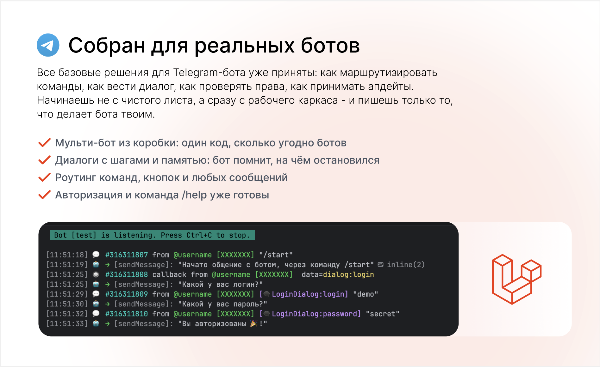

# Appto Telegram Bot



[](https://github.com/appto-dev/telegram-bot/actions/workflows/tests.yml)
[](LICENSE)

🇷🇺 Русский · [🇬🇧 English](#english)

Мульти-бот фреймворк для Telegram на Laravel: декларативная маршрутизация (команды,
callback-паттерны, текстовые триггеры, произвольные типы апдейтов), движок пошаговых диалогов,
встроенная авторизация и `/help`, доставка апдейтов через webhook или long polling — из коробки.

📖 **Полная документация:** [Русский](docs/ru/01-introduction.md) · [English](docs/en/01-introduction.md)

## Требования

- PHP 8.3+
- Laravel 13+

## Установка

```bash
composer require appto-team/telegram-bot
php artisan vendor:publish --tag=telegram-bot-config
php artisan migrate
```

## Быстрый старт

```php
// app/GreetBot/GreetBot.php
final class GreetBot extends Bot
{
    protected function boot(): void
    {
        $this->onCommand('start', StartCommand::class);
    }
}
```

```php
// app/GreetBot/Commands/StartCommand.php
final class StartCommand implements CommandHandler
{
    public function handle(UpdateContext $context): void
    {
        $context->reply('Привет! Я на связи 👋');
    }
}
```

```php
// config/telegram-bot.php
'bots' => [
    'greet' => [
        'token' => env('TELEGRAM_BOT_TOKEN'),
        'webhook_secret' => env('TELEGRAM_BOT_WEBHOOK_SECRET'),
        'bot' => \App\GreetBot\GreetBot::class,
    ],
],
```

```bash
php artisan telegram:poll greet
```

Отправьте боту `/start` — должен прийти ответ. Дальше — команды, кнопки, клавиатуры, диалоги,
права доступа и деплой через webhook подробно расписаны в
[документации на русском](docs/ru/01-introduction.md), начиная с
[4. Быстрого старта](docs/ru/04-quick-start.md).

## Поддержать проект

Если пакет оказался полезен — можно поддержать разработку в крипте:

| Валюта       | Адрес |
|--------------|-------|
| USDT (TRC-20) | `TWpVojBJ97h1X3JcZwAQRNEQjx7u1E3uZs` |
| BTC          | `bc1qu592r93ch2yhwj6tw5ttctx3fg39ydem43ch3t` |
| ETH          | `0x406F46D4c42ff77f74047Fc5672fc3Bc32ADB9d0` |
| TON          | `UQCeqwcvE9DAjHKHPHw2MHVD-FworhAYEs8BEy56lJhfX9nr` |

## Лицензия

MIT

---

<a id="english"></a>

## English

[⬆ Русский](#appto-telegram-bot) · 🇬🇧 English

Multi-bot Telegram framework for Laravel: declarative routing (commands, callback patterns, text
triggers, arbitrary update types), a step-by-step dialog engine, built-in authorization and
`/help`, webhook and long-polling delivery — out of the box.

📖 **Full documentation:** [English](docs/en/01-introduction.md) · [Русский](docs/ru/01-introduction.md)

### Requirements

- PHP 8.3+
- Laravel 13+

### Installation

```bash
composer require appto-team/telegram-bot
php artisan vendor:publish --tag=telegram-bot-config
php artisan migrate
```

### Quick start

```php
// app/GreetBot/GreetBot.php
final class GreetBot extends Bot
{
    protected function boot(): void
    {
        $this->onCommand('start', StartCommand::class);
    }
}
```

```php
// app/GreetBot/Commands/StartCommand.php
final class StartCommand implements CommandHandler
{
    public function handle(UpdateContext $context): void
    {
        $context->reply('Hi! I\'m here 👋');
    }
}
```

```php
// config/telegram-bot.php
'bots' => [
    'greet' => [
        'token' => env('TELEGRAM_BOT_TOKEN'),
        'webhook_secret' => env('TELEGRAM_BOT_WEBHOOK_SECRET'),
        'bot' => \App\GreetBot\GreetBot::class,
    ],
],
```

```bash
php artisan telegram:poll greet
```

Send `/start` to the bot — you should get a reply. Commands, buttons, keyboards, dialogs,
permissions and webhook deployment are covered in full in the
[English documentation](docs/en/01-introduction.md), starting with
[4. Quick start](docs/en/04-quick-start.md).

### Support the project

If this package has been useful, you can support development with crypto:

| Currency     | Address |
|--------------|---------|
| USDT (TRC-20) | `TWpVojBJ97h1X3JcZwAQRNEQjx7u1E3uZs` |
| BTC          | `bc1qu592r93ch2yhwj6tw5ttctx3fg39ydem43ch3t` |
| ETH          | `0x406F46D4c42ff77f74047Fc5672fc3Bc32ADB9d0` |
| TON          | `UQCeqwcvE9DAjHKHPHw2MHVD-FworhAYEs8BEy56lJhfX9nr` |

### License

MIT
